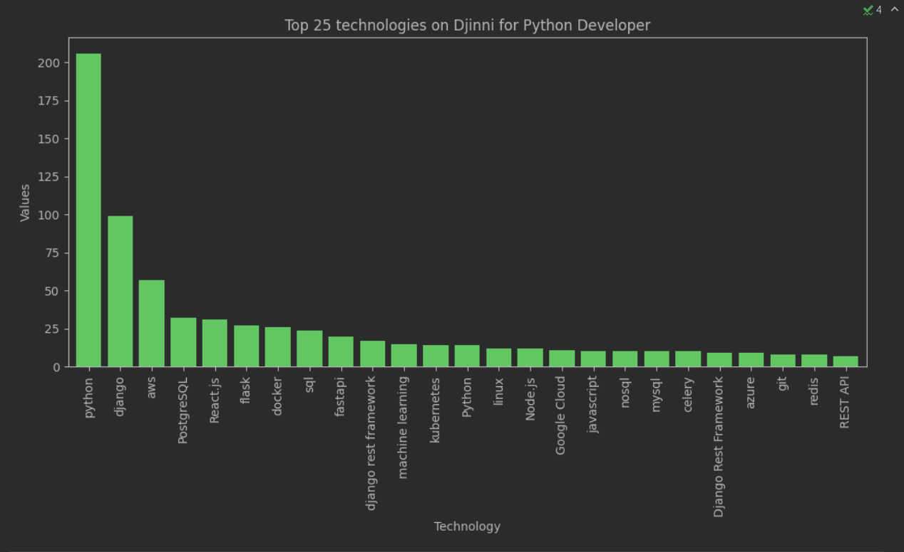

# Djinni_technologies_statistics

* You can scrap Python Developer vacancies from Djinni website.
* And analyze scraped data to define most popular technologies.

## Sample of the bar



## How to start

```shell
git clone https://github.com/yhwh6/Djinni_technologies_statistics.git
cd Djinni_technologies_statistics
python -m venv venv
source venv/bin/activate # on MacOS
venv\Scripts\activate # on Windows
pip install -r requirements.txt
```

and

```shell
cd djinni_scraping
scrapy crawl vacancies -O vacancies.csv
```

finally:

```shell
Open `DB_analysis/vacancies_analysis.ipynb` with Jupyter Notebook and run cells.
```